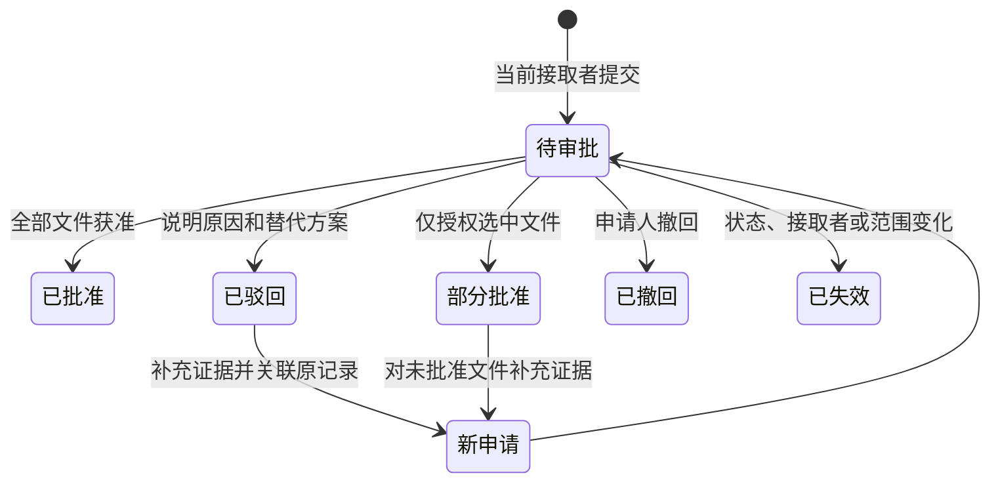

# 任务可修改范围复议（GitHub 过渡阶段）

任务接取者可以申请把只读文件或原范围外的具体文件加入 `editablePaths`。申请由任务发布者或管理员人工审批；批准前继续执行原范围，批准后只新增获准的具体文件，并递增范围版本。审批不改变任务目标、验收标准、冻结的 `baseSha`、目标分支或贡献点。

## GitHub 阶段的真实边界

目前 Desktop 会同步 GitHub 仓库并创建本机 worktree。GitHub 的常规角色控制的是仓库访问，读取权限包含获取仓库内容的能力，因此此实现提供平台内的修改范围控制，不能保证已克隆仓库的文件级保密。依据：[GitHub 仓库角色](https://docs.github.com/en/organizations/managing-user-access-to-your-organizations-repositories/managing-repository-roles/repository-roles-for-an-organization)。

复议记录和实际授权保存在现有 Supabase 控制面，无需先建设独立 Git 服务。GitHub Issue 中的文件清单是便于协作的副本，修改 Issue 正文、添加评论、修改本机文件或向任务分支推送，都不会自动改变平台授权。详细申请理由与证据留在平台；申请人只能查看自己的记录，发布者和管理员可以查看该任务的全部记录。

当前入口覆盖 Desktop / 中央 API。GitHub 网页上的直接合并，以及已经发放的仓库凭据，不受这组 API 完整约束。需要真正文件级最小暴露时，应在后续改用由服务端按清单导出的任务快照或独立任务仓库，并避免把源仓库凭据和完整 Git 对象库交给接取者；sparse checkout 不能作为保密边界。

## 接取者如何提出合理申请

在进行中的任务详情打开“修改范围复议”，每次填写 1–20 个具体仓库相对文件路径。可以申请只读文件升级，也可以申请新增文件或明确指出的原范围外文件；服务端不会为此列出原范围外的目录或文件内容。

| 材料 | 应说明什么 |
| --- | --- |
| 文件及逐项理由 | 与哪条验收标准有关、具体要改什么、为什么这个文件不可替代 |
| 任务阻塞与总理由 | 在当前范围内无法完成的行为，避免只写“方便开发” |
| 证据 | 失败用例、错误信息、调用关系或已有上下文；不需要提交整个源码文件 |
| 替代方案 | 是否可以仅改当前文件、复用接口、添加适配层或拆分任务，以及为何不适合 |
| 验证与影响控制 | 将运行的测试、受影响调用方以及如何撤回修改 |

例如：任务要求修复会话过期刷新，但可修改范围只有 `src/pages/login.tsx`。接取者可以申请 `src/auth/session.ts`，解释过期判断集中在该模块，提供刷新失败测试，说明仅在页面补丁会遗漏其他调用入口，并给出会话过期、刷新成功及失败回退的测试计划。无需申请整个 `src/auth/**`。

申请不接受目录、通配符、绝对路径、路径跳转和存在歧义的特殊路径。默认禁止路径及任务 `deniedPaths` 始终优先，管理员审批也不能通过复议覆盖它们。文件名以 Git 的大小写为准，禁止规则额外进行大小写不敏感检查。

## 审批与再次复议

只有该任务的发布者或平台管理员可以审批；普通维护者身份本身不足以审批他人的任务。任何角色都不能审批自己的申请。发布者本人也是接取者时，需要另一位管理员处理。

审批人逐项检查必要性、文件数量、替代方案和验证计划，手动勾选批准的文件，并填写意见。可以全部批准、部分批准或全部驳回。不能在审批时顺便添加未申请的文件，也不能放宽 `deniedPaths` 或环境命令。

每个任务同时只能有一条待审批申请。待审批期间可以撤回，修改材料后重新申请。驳回或部分批准后，可通过“补充证据再复议”建立 `retryOf` 关联，新证据不得与上次完全相同；此前审批意见保留，不能覆盖旧记录。每条决定只允许一个有效的后续复议分支，再次被驳回时从最新决定继续。后续复议被撤回或失效后，可以从原决定重新提交，保留历史记录和关联关系。

申请没有自动批准或默认超时放权。它也不暂停原范围内的开发；接取者可以交付已经满足原范围的任务，此时待审批申请失效。释放、取消、转交任务或修改范围同样使旧申请失效，防止重新认领后复用旧申请。

批准的是任务范围，非接取者的仓库角色；任务释放后已批准的范围仍属于该任务，后续接取者沿用最新版本。任务结束后不能再通过复议扩大范围。

## 子任务必须逐级申请

子任务的新增可修改文件必须已经包含在父任务的可修改范围内，父任务只读权限不足以向下授予修改权。若父任务也无权修改，应先由父任务接取者提出复议，获准后再提交子任务申请。请求和审批阶段都会检查父任务当前范围；父范围在校验后变化时，事务返回冲突，要求刷新后重试。

## 生效与交付

SQL 事务锁定父任务、当前任务和申请，比较 API 已校验的范围快照与当前版本，然后一次性完成决定、`scope_json` 更新、`analysis_json.scope` 同步和审计记录。部分批准也只递增一次 `revision`。批准文件从精确只读条目中移除；若只读条目是 glob，则保留该条目，具体可修改授权对对应文件优先，其余匹配文件仍只读。

审批成功后 API 尝试更新 GitHub Issue 的 `Files Involved` 段落。同步失败不会回滚已经生效的权限或要求再次审批，界面提示失败，发布者或管理员可点击“同步当前范围到 GitHub”重试。此同步是尽力更新的副本，不是跨数据库与 GitHub 的原子事务；并发同步或 GitHub 人工编辑导致不一致时，以平台范围为准并重新同步。

Desktop 提交交付前重新获取最新任务范围，本机 Agent 和 API 都拒绝越界文件。API 验收时进一步读取完整 PR 文件清单，核对目标分支、任务分支、来源仓库，以及重命名前后的路径，避免任务分支额外提交绕过提交包校验。文件清单不完整或超出 GitHub 3,000 文件上限时拒绝验收；分页期间版本变化同样拒绝，并用校验过的 head SHA 发起合并。依据：[GitHub PR 文件清单与合并 API](https://docs.github.com/en/rest/pulls/pulls)。

## 接口和升级

| 接口 | 用途 |
| --- | --- |
| `GET /api/tasks/:id/scope-requests` | 查看本人记录；发布者和管理员可查看全部 |
| `POST /api/tasks/:id/scope-requests` | 提交申请，包含 `scopeRevision`、`files`、`reason`、`evidence`、`alternatives`、`validationPlan` 及可选 `retryOf` |
| `POST /api/tasks/:id/scope-requests/:requestId/decision` | `decision: approve/reject`、`approvedPaths` 和 `reason` |
| `POST /api/tasks/:id/scope-requests/:requestId/withdraw` | 撤回本人待审批申请 |
| `POST /api/tasks/:id/scope/sync` | 重新同步当前范围到 GitHub |

先应用 `infra/supabase/migrations/202609080001_scope_requests.sql`，再部署 API 和 Desktop。迁移新增范围申请表、原子函数与任务状态触发器，不需要初始化旧任务数据；表开启 RLS，函数与表只授予 `service_role`。没有应用迁移的 API 会因缺少表/函数失败，不能仅更新客户端或直接跳过迁移。

本地验证使用 PGlite 执行全部 SQL 迁移，并通过服务层测试请求、部分批准、拒绝后复议、重复决定、范围快照冲突、父子任务边界和材料可见性；GitHub 适配器使用假客户端验证路径检查和固定 SHA 合并。本机 Agent 测试覆盖批准前拒绝、批准后允许、未获准文件继续拒绝。PGlite 在进程内串行执行请求，生产 PostgreSQL 多连接下的锁竞争仍需部署环境验证。
